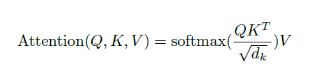
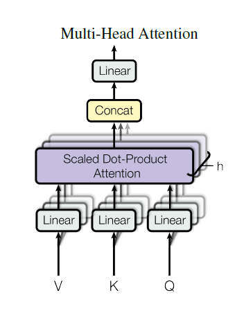
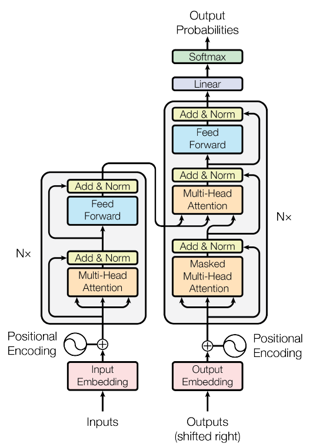
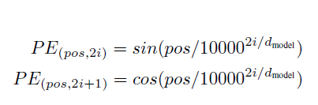

Before this paper, the dominant seq2seq models were based on complex RNNs or CNNs with encoder and decoder blocks, and attention mechanism. This paper proposes the `Transformer` architecture that uses no RNNs and CNNs.  
# 1. Problems with RNN  
- Sequential computation (did not support parallel computing)  
- Limited context size  
- Vanishing and exploding gradients  
- Struggle to remember information from many steps ago due to gradient issues. (long context = memory loss)  

Previous RNN-based models, let's say text2text models, used to determine the next word based on a hidden state that encoded all the previous words in the context. While this worked to some extent, the real language, obviously, won't work that way.  
For example, "I went to the restaurant and ordered a ..." an RNN might output something like "pizza", which might be used in most of its training examples. Consider some big sentence like "Alice, who is studying in college, lives in Delhi, loves cooking, and has a friend named Bob. Who are we talking about?". It might say "Bob", while the subject is "Alice". RNNs are prone to memory losses when provided with too many details. They do not know how much focus they should be having on each word. This is where attention comes into the picture. We need our model to understand how much attention/focus it should give to each of its previous words to predict the next word.  

# 2. Attention  
The paper describes attention technically as "An attention function can be described as mapping a query and a set of key-value pairs to an output, where the query, keys, values, and output are all vectors. The output is computed as a weighted sum of the values, where the weight assigned to each value is computed by a compatibility function of the query with the corresponding key."  

## 2.1 Scaled Dot Product Attention  

Here, `Q` is the query vector, `K` is the keys vector, `V` is the values vector and dₖ is the number of dimensions of the keys vector, otherwise called number of embeddings. The formula is quite simple to understand but before understanding this, we need to know how text is represented in numbers. In simple terms, we can understand it like this. Whole language is assumed to have `vocab_size` number of words (or more accurately, tokens) in its vocabulary. Each token is embedded into a vector of size `n_embd` via a learned embedding matrix. These embeddings capture semantic information, not weights relative to vocabulary items. For example, the word `hello` can be represented as [0.001, 0.121, 0, 0.043 ...]. To encode a whole sentence, we encode each token separately and form a matrix. For example, "How are you" is represented as [[0.001, 0.20, 0.32 ...], [0.4, 0, 0.134 ...], [0.755, 0.436, 0.890 ....]] whose shape is `num_tokens` x `n_embd`. Usually, when training we do not take the whole sentence as it is, instead we take only `seq_len` number of tokens at a time for computational reasons. So, always our training examples are of the shape `seq_len` x `n_embd`.  

## 2.2 Self-Attention  
In this type of attention, each token attends to all the words in the same sequence, including itself to build the contextual understanding of the sentence. That means we take all the Q, K and V vectors to be same, same as our sentence embeddings.  
Let's simulate our "How are you" example to understand how the formula works.  
Initially, Q = K = V = embeddings. (The following encodings are just random numbers, not accurate)

| Token | Query (Q)   | Key (K)     | Value (V)   |
| ----- | ----------- | ----------- | ----------- |
| How   | [1.0, 0.5]  | [1.0, 0.5]  | [1.0, 0.5]  |
| are   | [0.9, 1.2]  | [0.9, 1.2]  | [0.9, 1.2]  |
| you   | [0.4, 1.0]  | [0.4, 1.0]  | [0.4, 1.0]  |

### Step-1 : Q.KTranspose  
We multiply Q of size `seq_len` x `n_embd` with KTranspose of size `n_embd` x `seq_len` to produce a similarity matrix of size `seq_len` x `seq_len`. Essentially, it is performing dot product of two vectors, whose cos inverse is the angle between the two vectors or how close/similar the two vectors are. We call this as `similarity matrix` for this reason.  

### Step-2 : Scaling  
We now divide our similarity matrix with √dₖ to normalize our vectors, so that computation happens faster. This prevents the exploding gradient issues.

### Step-3 : Softmax  
Now we apply softmax function over our matrix to get the attention percentages of each vector on one another.  

| From → To | How  | are  | you  |
| --------- | ---- | ---- | ---- |
| **How**   | 0.31 | 0.38 | 0.31 |
| **are**   | ...  | ...  | ...  |
| **you**   | ...  | ...  | ...  |

### Step-4 : Multiply with V  
We multiply our `seq_len` x `seq_len` matrix with V, whose size is `seq_len` x `n_embd` to finally get the attention scores of each of our word with each of the word in the vocabulary.

| Token | New Representation (after self-attention) |
| ----- | ----------------------------------------- |
| How   | [0.776, 0.921]                            |
| are   | [ ... , ... ]                             |
| you   | [ ... , ... ]                             |

### 2.3 Multihead Attention  

This is where parallel computation comes into play. Instead of computing one attention head at a time, we compute `n_heads` parallelly. This not only leads to computational efficiency, but also makes our model focus on different perspectives of input at the same time so that it will learn the context in more detail. After calculating the attention for `n_heads`, we concatenate all our outputs and apply a linear layer to get back to our desired shape of `seq_len` x `dₖ`.  

That's it. We are done with the major part of the paper, now it is just the transformer architecture.

## 3. Architecture  

You might have seen this picture a 100 times by now. The left side part of it is called `Encoder` and the right side is called `Decoder`. Encoder is responsible for returning the contextual understanding of our input, which is passed to Decoder, whose job is to generate the translated output. This transformer model is actually a language translator which is trained on the standard WMT 2014 English-German dataset.  

## Encoder  
Initially our English text is processed into embeddings using a tokenizer to whom we add positional encodings. Positional encodings are crucial in understanding the context of the input, it gives us idea of relative locations of each word in the sentence. It is formulated as follows.  

Now this encoded input is passed into an encoder block. First we pass it into a multi-head attention block, then normalize it (residual connection) and pass to a feed forward layer and normalize (residual connection) it again. We repeat this `n_layers` number of times as suggested by the paper, to stack multiple encoder blocks for better understanding of the context. The output is then fed to the decoder.  

## Decoder  
To this block, we also pass the output, right shift it by one token and encode it again to feed to the masked multi-head attention. Masked multi-head attention is a type of multi-head attention where we prevent our model from seeing the next words in the training examples or during inference. Then we normalize. We pass this to multi-head attention whose input also contains output of encoder. One of Q, K, V to this multi-head attention is from masked multi-head attention and the other two from encoder. Then again a residual connection from masked multi-head attention and normalize. Pass to feed forward layer and normalize (residual connection). Repeat this for `n_layers` again to stack decoder layers. Then the output is passed to a linear layer and finally a softmax function is applied to get the output logits.

Decode these logits using the same tokenizer that we used to embed words to get the translated output.  

All the values for parameters we discussed above are used in the code. Most of the values are taken same as the paper, but for some values such as `batch_size`, `seq_len` are compromised due to computational reasons.
